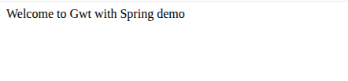
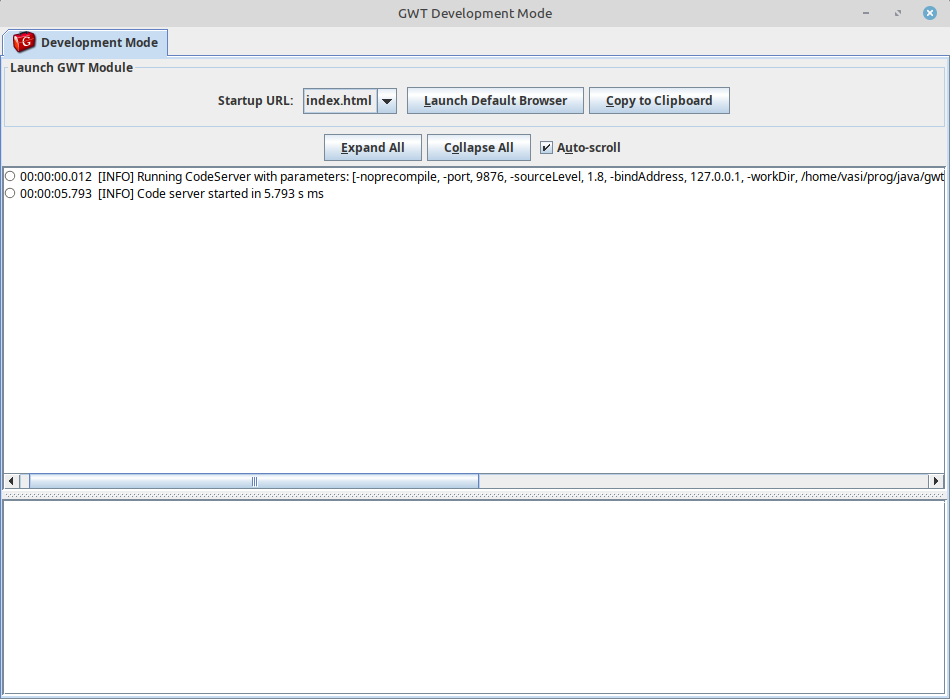

## Простое SpringBoot приложение с GWT и каким-то отладочным окном с логами.

Оригинальный проект [https://github.com/zak905/boot-gwt](https://github.com/zak905/boot-gwt)

### Запуск
1. Сначала запустить `mvn spring-boot:run` (`run_step1.sh`)
2. И затем в отдельном shell `mvn gwt:devmode -Pgwt-dev` (`run_step2.sh`)
3. Открыть http://127.0.0.1:8080/index.html
в окне будет строка "Welcome to Gwt with Spring demo"



Кроме того, будет открыто dev:


Ключевые моменты:
1. Приложение как обычно @SpringBootApplication 
2. Определена EntryPoint :

````java
public class AppEntryPoint implements EntryPoint {
    public void onModuleLoad() {
        RootPanel.get().add(new Label("Welcome to Gwt with Spring demo"));
    }
}
````

3. В AppEntryPoint к объекту RootPanel (создается автоматически) добавлена Label. 

## Readme автора [https://github.com/zak905/boot-gwt](https://github.com/zak905/boot-gwt):

### Dev Mode

To run devmode:

`mvn spring-boot:run` and then in a different window `mvn gwt:devmode -Pgwt-dev`

### Production
`mvn clean -Pgwt-prod` and then `java -jar target/boot-gwt-0.0.1-SNAPSHOT.jar`